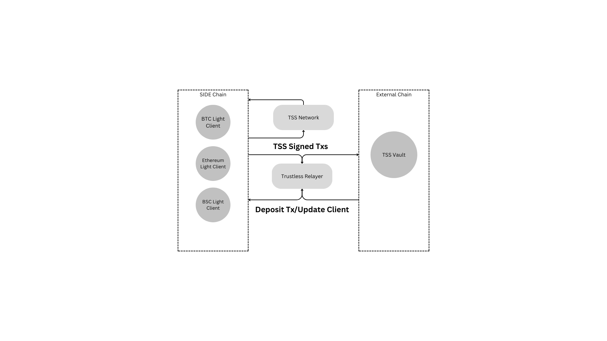

# Omini Chain Bridge

## Introduction

This specification outlines a solution enabling users to bridge assets without having to trust any third parties.

## Architecture


## Definition

 - `Light Client` empowers clients (applications, devices, blockchains, etc.) to engage with blockchains and efficiently verify the state on that blockchain through cryptographic methods, without the need to process the entire blockchain state.
 - `Threshold Signature Scheme (TSS)` enables users to establish a flexible threshold policy. With TSS technology, signing commands are replaced by distributed computations, eliminating the private key as a single point of failure. For instance, if three users each receive a share of the private signing key, at least two out of the three users must collaborate to construct the signature for a transaction.
 - `Vault` is an external account on counterparty blockchains used to store escrowed assets. It is controlled by a Threshold Signature Scheme (TSS).
 - `Relayer` is a permissionless off-chain process with the ability to read the state of and submit transactions to a defined set of ledgers using the SIDE bridge protocol.
 - `TSS network` is a collaborative network consisting of validators, each possessing a share of the TSS private key. This collective ownership is crucial for controlling the vault account effectively.
 - `Peggy Token`: A tokenized asset pegged on the SIDE blockchain, enabling smooth interoperability. This involves locking assets on a counterparty chain and minting equivalent tokens on the SIDE blockchain, facilitating seamless cross-chain asset transfers while maintaining a fixed value ratio. All peggy tokens must begin with the prefix "side," such as sideBTC or sideETH. This naming convention ensures clarity and consistency across different pegged assets on the SIDE blockchain.
   
## Technical Specification

Similar to many other bridge solutions, we wrap bridged assets into pegged assets with a 1:1 ratio. Users have the flexibility to mint pegged assets by initiating a `MintRequest` or burn pegged assets through the execution of a `BurnRequest` to withdraw native assets.

To prevent replay attacks, the states of both inbound and outbound transactions must be stored on the state chain.

```ts
interface MintRequest {
   sourceChainId: string
   hash: string,
   status: Enum,
   tx: bytes[],
}

interface BurnRequest {
   destChainId: string,
   hash: string,
   status: Enum,
   tx: bytes[],
}
```

There should be the following functions to facilitate obtaining transactions or iterating through transactions.

```ts
function getRequest(hash: string) {

}

function getRequests(status: Enum, start: int, limit: int) {

}
```

### Transaction Flow 


### Light Client

The light client traces states on counterparty chains and can be implemented in two types: probabilistic finality for PoW consensus blockchains (e.g., Bitcoin) and deterministic finality for PoS blockchains (e.g., Cosmos and Ethereum). 

#### Data Structure

 - `Client State`
```ts
interface ClientState {
   chainId: string,
   type: string,
   latestHeader: Header,
   comfirmation: u64,
   frozen: bool,
   validators: Vec<pubkey, u64>, // only used for PoS client
   difficulty: u64, // only used for PoW client
}
```
 - `Header`
```ts
interface Header {
    height: u64,
    hash: string,
    previous_hash: string,
    root: string,
}
```

 - Update Client

The relayer updates the counterparty blockchain header to the on-chain light client. For PoS consensus light clients, the header should be valid by verifying the signatures of validators or the syncing committee (Ethereum). For PoW consensus light clients, it should check if the block hash matches the difficulty. Headers should be allowed to override before confirmation since the longest blockchain might have a different height than the shorter one.

 ```ts
function updateClient(identifier: string, clientState: ClientState, header: Header) {}
```

 - Verify Transaction

Transactions can be verified by checking the inclusion of the Merkle tree by the on-chain light client.

```ts
function verifyTransaction(identifer: string, Header: u64, txHash: string, proof: byte[]) {}
```

#### Implementations

 - Bitcoin Light Client
 - Ethereum Light Client
 - BSC Light Client
 - Cosmos Light Client
 - Solana Light Client

### TSS Network

Among the numerous Threshold Signature Schemes, the [Multi-Party Threshold Signature Scheme](https://github.com/bnb-chain/tss-lib) as the optimal choice due to its resharing feature. This feature enables the TSS network to reshare the shares of the private key when the validator set undergoes changes.

All validators are required to operate a TSS Node to be eligible for rewards. Similar to signing blocks, validators must sign a minimum of 80% of transactions within a slashing epoch. Failure to meet this criterion results in the loss of rewards, including their block rewards.

 - Setup
   
```go
// Set up the parameters
// Note: The `id` and `moniker` fields are for convenience to allow you to easily track participants.
// The `id` should be a unique string representing this party in the network and `moniker` can be anything (even left blank).
// The `uniqueKey` is a unique identifying key for this peer (such as its p2p public key) as a big.Int.
thisParty := tss.NewPartyID(id, moniker, validator_pubkey)
```

 - Coordination

The TSS network randomly selects a node as the leader in each epoch. This leader is responsible for handling tasks such as fetching signing requests and writing signatures back to the blockchain.

 - Keygen

Use the `keygen.LocalParty` for the keygen protocol. The save data you receive through the `endCh` upon completion of the protocol should be persisted to secure storage.

```go
party := keygen.NewLocalParty(params, outCh, endCh, preParams)
// Omit the last arg to compute the pre-params in round 1
go func() {
    err := party.Start()
    // handle err ...
}()
```

 - Signing

 Use the `signing.LocalParty` for signing and provide it with a message to sign. It requires the key data obtained from the keygen protocol. The signature will be sent through the `endCh` once completed.

Please note that `t+1` signers are required to sign a message and for optimal usage no more than this should be involved. Each signer should have the same view of who the `t+1` signers are.

```go
party := signing.NewLocalParty(message, params, ourKeyData, outCh, endCh)
go func() {
    err := party.Start()
    // handle err ...
}()
```
 - Re-Sharing

Use the `resharing.LocalParty` to re-distribute the secret shares. The save data received through the `endCh` should overwrite the existing key data in storage, or write new data if the party is receiving a new share.

Please note that `ReSharingParameters` is used to give this Party more context about the re-sharing that should be carried out.
```go
party := resharing.NewLocalParty(params, ourKeyData, outCh, endCh)
go func() {
    err := party.Start()
    // handle err ...
}()
```

⚠️ During re-sharing the key data may be modified during the rounds. Do not ever overwrite any data saved on disk until the final struct has been received through the end channel.


### Relayer

To simplify the implementation, there should be at most one bridge connecting two blockchains. This implies that only one vault should exist on the counterparty chain.

The `pendingTransactions` function computes the set of all valid transactions that need to be relayed from one chain to another, taking into account the state of both chains.

The `submitTransaction` function is chain-specific, involving the submission of a transaction. Transactions can be submitted either individually as single transactions or atomically as a single transaction, depending on the capabilities of the chain.

The `relay` function is invoked at regular intervals but no more frequently than once per block on either chain.

```ts
function relay(c: Chain>) {
    const txs = chain.pendingTransactions(c.counterparty)
    for (const localTx of txs)
      chain.submitDatagram(localTx)
}
```
