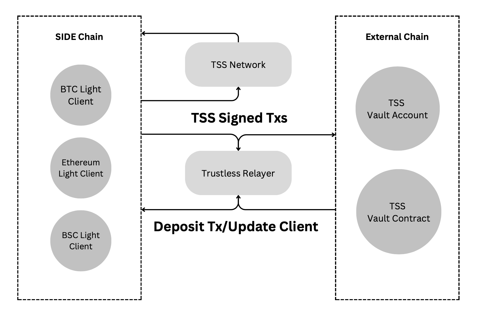
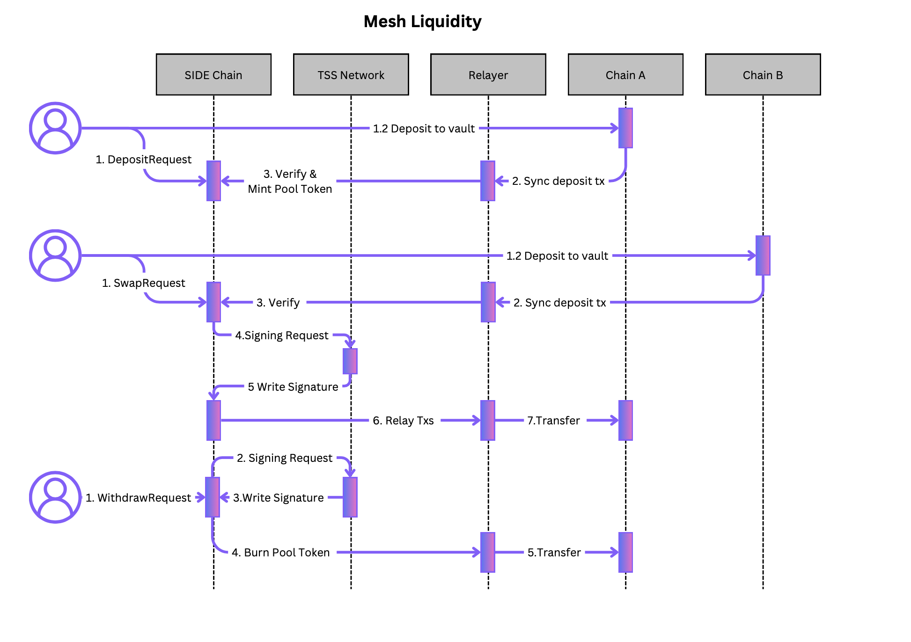

# Telebase

## Introduction

This specification outlines a solution enabling users to manage crosschain assets without having to trust any third parties.

## Architecture


## Definition

 - `Light Client` empowers clients (applications, devices, blockchains, etc.) to engage with blockchains and efficiently verify the state on that blockchain through cryptographic methods, without the need to process the entire blockchain state.
 - `Threshold Signature Scheme (TSS)` enables users to establish a flexible threshold policy. With TSS technology, signing commands are replaced by distributed computations, eliminating the private key as a single point of failure. For instance, if three users each receive a share of the private signing key, at least two out of the three users must collaborate to construct the signature for a transaction.
 - `Vault` is an external account or a contract on counterparty blockchains used to store escrowed assets. It is controlled by a Threshold Signature Scheme (TSS).
 - `Channel`, A channel functions as a conduit for interchain operations between a designated module on the SIDE blockchain and a vault on an external blockchain. It guarantees that the vault exclusively accepts transactions sent from the specified module. Additionally, it triggers an acknowledgment function of the module to update states by monitoring received transactions that interact with the vault on the external blockchain.
 - `Relayer` is a permissionless off-chain process with the ability to read the state of and submit transactions to a defined set of ledgers using the SIDE bridge protocol.
 - `TSS network` is a collaborative network consisting of validators, each possessing a share of the TSS private key. This collective ownership is crucial for controlling the vault account effectively.
 - `Peggy Token`: A tokenized asset pegged on the SIDE blockchain, enabling smooth interoperability. This involves locking assets on a counterparty chain and minting equivalent tokens on the SIDE blockchain, facilitating seamless cross-chain asset transfers while maintaining a fixed value ratio. For consistency and clarity, all peggy tokens must adhere to the naming convention: they should commence with the prefix `side/` followed by a hash generated from `chain_id`, `vault address`, and `symbol`. This ensures a standardized and identifiable nomenclature for peggy tokens.
   
## Telebase Core


To prevent replay attacks, the states of both `IntentRequest` and `SigningRequest` transactions must be stored on the state chain.

```ts
interface IntentRequest {
   channelId: string
   action: string,
   expectedSender: string, // the expected sender of inboundTx on counterparty chain
   hash: string,
   status: Enum,
   inboundTx: bytes[],
   createAt: u64,
}

interface SigningRequest {
   channelId: string,
   action: string,  // can be defined in app, such as AtomicSwap, LSD
   hash: string,
   status: Enum,
   outboundTx: bytes[],
   createAt: u64,
}
```

To enhance security, `IntentRequests` have a time limit of 24 hours. Any assets deposited after this designated time frame will not be processed and, consequently, will be forfeited. Users must adhere to the 24-hour limit to ensure the successful completion of the asset deposit on the external chain. Additionally, only one open request is allowed per account.

There should be the following functions to facilitate obtaining transactions or iterating through transactions.

```ts
function getRequest(hash: string) {

}

function getRequests(status: Enum, start: int, limit: int) {

}
```

### Light Client

The light client traces states on counterparty chains and can be implemented in two types: probabilistic finality for PoW consensus blockchains (e.g., Bitcoin) and deterministic finality for PoS blockchains (e.g., Cosmos and Ethereum). 

The light client on the SIDE blockchain is responsible for verifying that a inbound transaction has been executed on the counterparty blockchain. Its primary role is to ensure that the vault account has received the necessary assets as a result of the transaction.

#### Data Structure

 - `Client State`
```ts
interface ClientState {
   chainId: string,
   type: string,
   latestHeader: Header,
   comfirmation: u64,
   frozen: bool,
   validators: Vec<pubkey, u64>, // only used for PoS client
   difficulty: u64, // only used for PoW client
}
```
 - `Header`
```ts
interface Header {
    height: u64,
    hash: string,
    previous_hash: string,
    root: string,
}
```
 - Initilize Client

The Light Client can be initialized through on-chain governance by specifying parameters such as `clientId`, a trusted `Header`, `vault address`, and other relevant details.

```ts
function initialClient(identifier: string, clientState: ClientState, header: Header) {}
```
 
 - Update Client

The relayer periodically updates the latest state to the on-chain light client. The update frequency depends on the connected blockchain, and failure to update in a timely manner may result in the light client being unable to process the latest transactions.

The client state is fundamental to the security assumptions, and a vulnerable implementation poses risks to the bridge, increasing the potential for losing assets.

For **PoS consensus** light clients, verification includes the following conditions:
   1. The block should have a minimum threshold of voting power signatures from trusted validators.
   2. `chain_id` should be the same.
   3. `height` should be greater than the current height.
   4. The client state can be updated along with the inbound transaction or if the validator set has changed.

For **PoW consensus** light clients, verification includes the following conditions:
   1. Check if the block hash matches the difficulty.
   2. Check if the block includes the hash of the latest trusted block (height-1).
   3. `chain_id` should be the same.
   4. `height` should be greater than the current height.
   5. The client state should be updated at each height.
   6. Headers should be allowed to override before confirmation since the longest blockchain might have a different height than the shorter one.


 ```ts
function updateClient(identifier: string, clientState: ClientState, header: Header) {}
```

 - Verify Transaction

Transactions can be verified by checking the following conditions using the on-chain light client:

   1. Verifying if the transaction is included in the Merkle tree root of the block header.
   2. Verifying if the chain ID is the same.
   3. Verifying if the receiver is the vault address.
   4. Verifying if the transaction has executed successfully.
   5. Verifying if the transaction has deposited sufficient assets.
   6. Verifying if the transaction was executed within a designated time frame from the request start.

The relayer is responsible for generating the proof of inclusion, which helps ensure the integrity and validity of the transactions.

```ts
function verifyTransaction(identifer: string, header: Header, txHash: string, proof: byte[]) {}
```

#### Implementations

 - Bitcoin Light Client
 - Ethereum Light Client
 - BSC Light Client
 - Solana Light Client

### TSS Network

Among the numerous Threshold Signature Schemes, the [Multi-Party Threshold Signature Scheme](https://github.com/bnb-chain/tss-lib) as the optimal choice due to its resharing feature. This feature enables the TSS network to reshare the shares of the private key when the validator set undergoes changes.

All validators are required to operate a TSS Node to be eligible for rewards. Similar to signing blocks, validators must sign a minimum of 80% of transactions within a slashing epoch. Failure to meet this criterion results in the loss of rewards, including their block rewards.

The TSS Network acts as the owner of vaults on external blockchains. Its responsibility includes signing outbound transactions to approve the execution of transactions on external blockchains in accordance with `SigningRequest`s on the SIDE blockchain.


 - Setup
   
```go
// Set up the parameters
// Note: The `id` and `moniker` fields are for convenience to allow you to easily track participants.
// The `id` should be a unique string representing this party in the network and `moniker` can be anything (even left blank).
// The `uniqueKey` is a unique identifying key for this peer (such as its p2p public key) as a big.Int.
thisParty := tss.NewPartyID(id, moniker, validator_pubkey)
```

 - Coordination

The TSS network randomly selects a node as the leader in each epoch. This leader is responsible for handling tasks such as fetching signing requests and writing signatures back to the blockchain.

 - Keygen

Use the `keygen.LocalParty` for the keygen protocol. The save data you receive through the `endCh` upon completion of the protocol should be persisted to secure storage.

```go
party := keygen.NewLocalParty(params, outCh, endCh, preParams)
// Omit the last arg to compute the pre-params in round 1
go func() {
    err := party.Start()
    // handle err ...
}()
```

 - Signing

 Use the `signing.LocalParty` for signing and provide it with a message to sign. It requires the key data obtained from the keygen protocol. The signature will be sent through the `endCh` once completed.

Please note that `t+1` signers are required to sign a message and for optimal usage no more than this should be involved. Each signer should have the same view of who the `t+1` signers are.

```go
party := signing.NewLocalParty(message, params, ourKeyData, outCh, endCh)
go func() {
    err := party.Start()
    // handle err ...
}()
```
 - Re-Sharing

Use the `resharing.LocalParty` to re-distribute the secret shares. The save data received through the `endCh` should overwrite the existing key data in storage, or write new data if the party is receiving a new share.

Please note that `ReSharingParameters` is used to give this Party more context about the re-sharing that should be carried out.
```go
party := resharing.NewLocalParty(params, ourKeyData, outCh, endCh)
go func() {
    err := party.Start()
    // handle err ...
}()
```

⚠️ During re-sharing the key data may be modified during the rounds. Do not ever overwrite any data saved on disk until the final struct has been received through the end channel.


### Relayer

To simplify the implementation, there should be at most one bridge connecting two blockchains. This implies that only one vault should exist on the counterparty chain.

The `pendingTransactions` function computes the set of all valid transactions that need to be relayed from one chain to another, taking into account the state of both chains.

The `submitTransaction` function is chain-specific, involving the submission of a transaction. Transactions can be submitted either individually as single transactions or atomically as a single transaction, depending on the capabilities of the chain.

The `relay` function is invoked at regular intervals but no more frequently than once per block on either chain.

```ts
function relay(c: Chain>) {
    const txs = chain.pendingTransactions(c.counterparty)
    for (const localTx of txs)
      chain.submitDatagram(localTx)
}
```

### App structure

Telebase Apps should implement the `AbstractCrossChainApp` interface, tailoring it to their specific business logic.

```ts
public interface AbstractCrossChainApp {
   // on chain light client
   client LightClient;
   // route `IntentRequest` to handler
   function intentRequestRoute(intent: IntentRequest);
   // verify Inbound Tx and mint
   function onInboundAcknowledgement(txHash: string, proof: byte[]);
   // request TSS network for signing
   function requestSigning(signRequest: SigningRequest);
   // write TSS signature by TSS network leader
   function writeSignature(signRequest: SigningRequest, signature: string);
   // update status of tx execution
   function onOutboundAcknowledgement(txHash: string, proof: byte[]);       
}
```

## Telebase Apps

### Cross chain Bridge

The Cross-Chain Bridge is a Telebase app that enables users to deposit assets from an external blockchain to mint Peggy assets on the SIDE blockchain. It also facilitates the burning of Peggy assets on the SIDE blockchain to withdraw native assets on the external blockchain.

Similar to many other bridge solutions, we wrap bridged assets into pegged assets with a 1:1 ratio. Users have the flexibility to mint pegged assets by initiating a `IntentRequest` or burn pegged assets through the execution of a `SigningRequest` to withdraw native assets.

#### Transaction Flow 


### Atomic Swap

The Atomic Swap is a Telebase app that empowers users to execute cross-chain atomic swaps directly between two blockchains, allowing for transactions like swapping BTC for ETH.

#### Transaction Flow 


### Mesh Liquidity

The Mesh Liquidity is a Telebase app that establishes a cross-chain liquidity pool, enabling users to swap tokens within the pool without the need for transferring tokens between different chains.

#### Transaction Flow 


### Liquid Staking

The Liquid Staking Telebase app enables users to deposit ETH into Lido before its peggyed on the SIDE chain. This allows users to obtain rewards from both Lido and the SIDE chain. This app only works on ethereum for now.

In this app, the vault is a contract controlled by the TSS network.

#### Transaction Flow 

