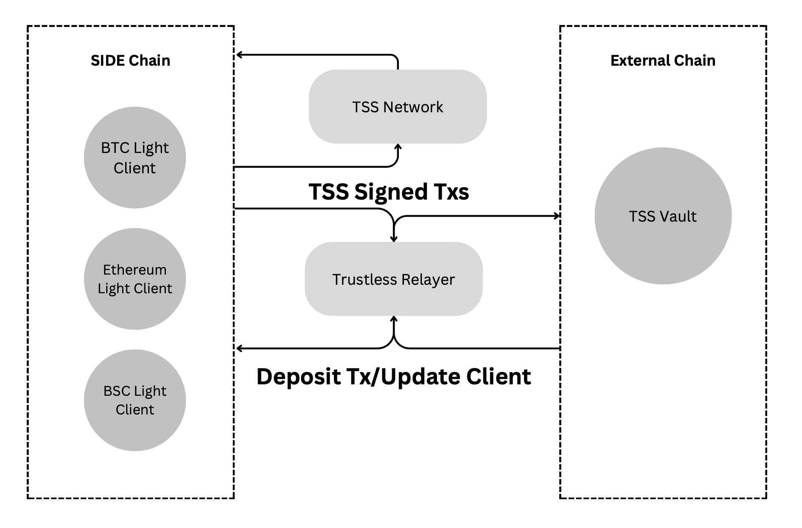

# SIDE CCA - Cross Chain Account

## Introduction

This specification outlines a solution enabling users to manage crosschain assets without having to trust any third parties.

## Architecture

## Definition

- `CCA` stands for Cross Chain Account, which is an Externally Owned Account (EOA) or a contract account on the remote blockchains used to store escrowed assets. It is controlled by a Threshold Signature Scheme (TSS).
 - `Light Client` empowers clients (applications, devices, blockchains, etc.) to engage with blockchains and efficiently verify the state on that blockchain through cryptographic methods, without the need to process the entire blockchain state.
 - `Threshold Signature Scheme (TSS)` enables users to establish a flexible threshold policy. With TSS technology, signing commands are replaced by distributed computations, eliminating the private key as a single point of failure. For instance, if three users each receive a share of the private signing key, at least two out of the three users must collaborate to construct the signature for a transaction.
- `Channel`, A channel functions as a conduit for interchain operations between a designated module on the SIDE blockchain and a vault on an external blockchain. It guarantees that the vault exclusively accepts transactions sent from the specified module. Additionally, it triggers an acknowledgment function of the module to update states by monitoring received transactions that interact with the `CCA` on the remote blockchain.
 - `Relayer` is a permissionless off-chain process with the ability to read the state of and submit transactions to a defined set of ledgers using the SIDE bridge protocol.
 - `TSS network` is a collaborative network consisting of validators, each possessing a share of the TSS private key. This collective ownership is crucial for controlling the `CCA` effectively.
 - `State Ledger` is a ledger that stores all interaction transactions with the `CCA` on the remote blockchains.
 - `Controller Chain` is a central blockchain, such as SIDE chain, which hosts the ledgers and coordinates the TSS network for signing.

## Modules
### Core
| # | Module | Status |
|--|--|--|
|1| [CCA Core](./core) | Draft |
|2| [client-semantics](./core/02-client-semantics) | Draft |
|3| [channel-semantics](./core/03-channel-semantics) | Draft |
|4| [request-semantics](./core/04-request-semantics) | Draft |
|5| [transaction-adapter](./core/05-transaction-adapter) | Draft |
|6| [routing](./core/06-routing) | Draft |
|7| [handler](./core/07-handler) | Draft |
|8| [relayer-semantics](./core/08-relayer-semantics) | Draft |
|9| [TSS Network](./core/09-tss-network) | Draft |

### Apps
| # | Module | Status |
|--|--|--|
|1| [01-cross-chain-bridge](./app/01-cross-chain-bridge) | Draft |
|2| [02-atomic-swap](./app/02-atomic-swap) | Draft |
|3| [03-cross-liquidity](./app/03-cross-liquidity) | Draft |
|4| [04-liquid-staking](./app/04-liquid-staking) | Draft |

## References 
 - [THORChain-Whitepaper-May2020](https://github.com/thorchain/Resources/blob/master/Whitepapers/THORChain-Whitepaper-May2020.pdf)
 - [Binance Open-Sources Threshold Signature Scheme Library
](https://www.binance.com/en/blog/all/binance-opensources-threshold-signature-scheme-library-398654406137536512)
 - [Chainflip Protocol Whitepaper](https://chainflip.io/whitepaper.pdf)
 - [ZetaChain](https://www.zetachain.com/docs/architecture/overview/)
