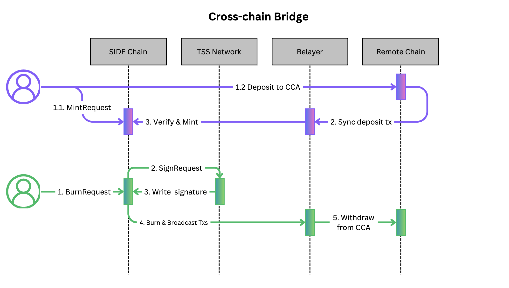

# Cross chain Bridge

The Cross-Chain Bridge is a CCA app that enables users to deposit assets from an external blockchain to mint Peggy assets on the contoller blockchain. It also facilitates the burning of Peggy assets on the controller blockchain to withdraw native assets on the external blockchain.

Similar to many other bridge solutions, we wrap bridged assets into pegged assets with a 1:1 ratio. Users have the flexibility to mint pegged assets by initiating a `IntentRequest` or burn pegged assets through the execution of a `SigningRequest` to withdraw native assets.

## Definition

 - `Peggy Token`: A tokenized asset pegged on the controller blockchain, enabling smooth interoperability. This involves locking assets on a counterparty remote chain and minting equivalent tokens on the contoller blockchain, facilitating seamless cross-chain asset transfers while maintaining a fixed value ratio. For consistency and clarity, all peggy tokens must adhere to the naming convention: they should commence with the prefix `side/` followed by a hash generated from `channel_id`, `CCA address`, and `symbol`. This ensures a standardized and identifiable nomenclature for peggy tokens.
 - A `DepositRequest` is a specialized form of `IntentRequest` that triggers a request enabling the remote CCA account to receive and lock a specified amount of tokens. These tokens can then be utilized to mint a voucher token on the controller chain.
 - A `WithdrawRequest` is a specialized type of `SigningRequest` that involves burning voucher tokens. It initiates a request to the TSS network to sign a transfer transaction on the remote chain, allowing users to withdraw their locked native tokens from the remote chain.

## Technical Specification
### Transaction Flow


### Data Structure

```ts
interface Deposit {
    sender: string, //local sender
    desired_sender: string, // remote sender
    token: Coin,
    channelId: string,
    status: string,
    createdAt: u64,
    completedAt: u64,
}
```
- Deposit: 0x01 | sender | desired_sender | channelId  -> ProtocolBuffer(Deposit)

```ts
interface DenomTrace {
    channelId: string,
    vaultAddress: string,
    denom: string,
}
```
- Deposit: 0x02 | channelId | vaultAddress | denom  -> ProtocolBuffer(DenomTrace)


```ts
class DepositEthereumResposne extends DefaultEthereumResponseAdapter<Deposit> {
    verify() {
        if (super.verify()) return false;
        // check ERC20 tokens later
        if(this.txResponse.value !== this.state.token.amount) return false
        return true;
    }
}
```


### Messages
```proto
message MsgDeposit {
    string desired_sender = 1;
    Coin token = 2;
    string channelId = 3;
}
```
```proto
message MsgWithdraw {
    string recipient = 1;
    Coin token = 2;
    string channelId = 3;
}
```
### MessageHandler

```ts
function handleMsgDeposit(msg: MsgDeposit) {

    // process request
    const request: IntentRequest  = {
        channelId: msg.channelId,
        action: "Deposit",
        expectedSender: msg.desired_sender, // the expected sender of inboundTx on counterparty chain
        hash: "",
        status: "INITIATED",
        inboundTx: [],
        createAt: block.timestamp,
    }

    store.registerInboundSigningRequest(request)

    cosnt deposit = {
        sender: msg.sender,
        desired_sender: msg.desired_sender, // remote sender
        token: msg.token,
        channelId: msg.channeId,
        status: "INITIATED",
        createdAt: block.timestamp,
        completedAt: 0,
    }
    store.save(deposit)
}
```

```ts
function handleMsgWithdraw(msg: MsgWithdraw) {
    const channel = store.getChannel(msg.channelId)
    const adapter = TX_REGISTRY.getAdapter(msg.channelId)

    // naming check
    const tokenMeta = store.getTokenMeta(msg.token.denom)
    if (msg.token.denom !== hash(`${channel.id}/${channel.vaultAddress}/${tokenMeta.denom}`)) {
        throw new Error("Can not withdraw the tokens")
    }
    // convert voucher coin to remote tokens
    // TODO: process ERC20 later
    const value = parseInt(msg.token.amount)
    const data = ""
    store.registerOutboundSigningRequest(adapter.buildSigningRequest(
        "WITHDRAW", channel, msg.recipient, value, data
    ))
}
```

### Transaction Handler

```ts
function onInboundExecuted(request: IntentRequest) {
}
```
```ts
function onInboundConfirmed(request: IntentRequest) {

}
```
```ts
function onInboundFinalized(request: IntentRequest) {

    const key = `0x01|${request.sender}|${request.desired_sender}|${request.channelId}`
    const deposit = store.getDeposit(key)
    const channel = store.getChannel(request.channelId)

    const adapter = new DepositEthereumResposne(request, channel,  deposit)
    const ok = adapter.verify()
    if(!ok) return

    // Mint voucher tokens
    const denom = hash(`${channel.id}/${channel.vaultAddress}/${deposit.token.denom}`);
    const voucherToken = new Coin(deposit.token.amount, denom);
    bank.mintToken(voucherToken)
    bank.sendToken(moduleAddress, deposit.sender, voucherToken)

    // save denom trace
    store.save(denom, {
       channelId: channel.id,
       vaultAddress: channel.vaultAddress,
       denom: deposit.token.denom,
    })

}
```
```ts
function onInboundExpired(request: IntentRequest) {

}
```

```ts
function onOutboundSigned(request: SigningRequest) {
    // Burn voucher tokens
    bank.burnToken(request.token)

}
```
```ts
function onOutboundBroadcasted(request: SigningRequest) {

}
```
```ts
function onOutboundExecuted(request: SigningRequest) {

}
```
```ts
function onOutboundConfirmed(request: SigningRequest) {

}
```
```ts
function onOutboundFinalized(request: SigningRequest) {

}
```

