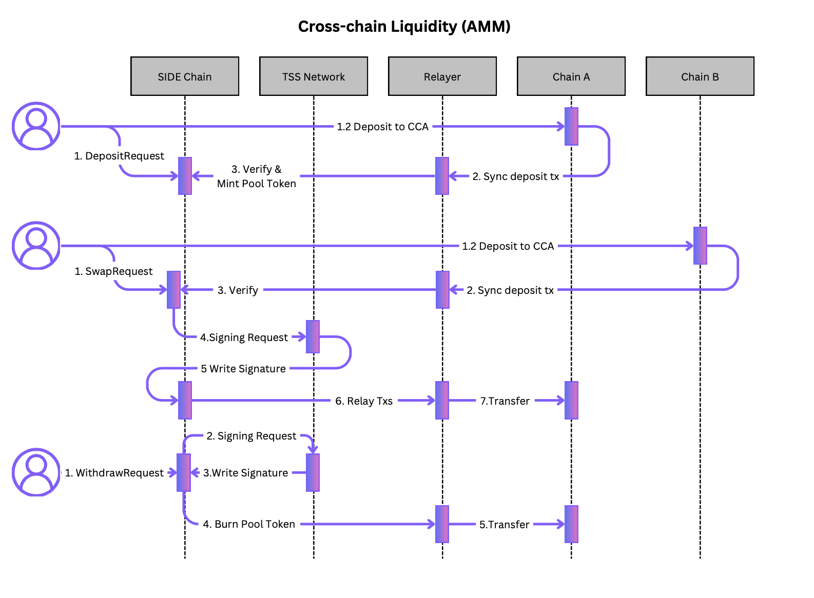

# Cross Chain Liquidity

The Cross Chain Liquidity is a CCA app that establishes a cross-chain liquidity pool, enabling users to swap tokens within the pool without the need for transferring tokens between different chains.

## Technical Specification
### Transaction Flow


### Data Structure
```ts
interface PoolAsset {
  channelId: string;  // native or channel_id
  balance: Coin;
  // percentage: 50 for 50%
  weight: int32;
}
```

```ts
interface WeightedPool {
  creator: string,
  id: string;
  assets: []PoolAsset;
  swapFee: int32;
  // the issued amount of pool token in the pool. the denom is pool id
  supply: Coin;
  status: PoolStatus;
}

interface Deposit {
    sender: string, // local sender
    desired_sender: string, // remote sender
    token: Coin,
    channelId: string,
    status: string,
    createdAt: u64,
    completedAt: u64,
}
```
- Deposit: 0x01 | sender | desired_sender | channelId  -> ProtocolBuffer(Deposit)


```ts
class DepositEthereumResposne extends DefaultEthereumResponseAdapter<Deposit> {
    verify() {
        if (super.verify()) return false;
        // check ERC20 tokens later
        if(this.txResponse.value !== this.state.token.amount) return false
        return true;
    }
}
```


### Messages
```proto
message PoolToken {
    string channelId = 1;
    Coin token = 2;
    string desiredSender = 3;
    u32 weight = 4;
}

message MsgCreatePool {
    u32 swapFee = 1;
    repeated PoolToken tokens = 2;
}
```
```proto
message MsgMultiDeposit {
    string desiredSender = 1;
    string poolId = 2;
    repeated Coin tokens = 3;
    string channelId = 4;
}
message MsgSingleDeposit {
    string desired_sender = 1;
    string poolId = 2;
    Coin token = 3;
    string channelId = 4;
}
```
```proto
message MsgWithdraw {
    string recipient = 1;
    string poolId = 2;
    Coin token = 3;
    string channelId = 4;
}
```
```proto
message MsgSwap {
    string channelId = 1;
    string recipient = 2;
    string poolId = 3;
    Coin tokenIn = 4;
    Coin tokenOut = 5;
    u64 slippage = 6;
}
```
### MessageHandler

```ts
function handleMsgCreatePool(msg: MsgCreatePool) {

    let poolId = store.getIncrementalPoolId() //
    let poolAssets = []
    let totalWeight = 0;
    let remoteAsset = 0;
    for(t in msg.tokens) {
        if(t.channelId === 'native') {
            let escrowedAddress = getEscrowedAccount(`${AppName}/${poolId}`)
            bank.sendTokenToAccount(msg.sender, escrowedAddress, t.token)

            poolAssets.push({
                channelId: t.channelId;  // native or channel_id
                balance: t.token;
                weight: t.weight;
            })
        } else {
            // request remote deposit
            const request: IntentRequest  = {
                channelId: t.channelId,
                action: "CreatePool",
                expectedSender: t.desired_sender, // the expected sender of inboundTx on
                expectedReceivedToken: t.token,
                hash: "",
                referenceId: poolId,
                status: "INITIATED",
                inboundTx: [],
                createAt: block.timestamp,
            }

            store.registerInboundSigningRequest(request)
            remoteAsset++;

            poolAssets.push({
                channelId: t.channelId;  // native or channel_id
                balance: new Coin(0, t.token.denom);
                weight: t.weight;
            })
        }

        totalWeight += t.weight;
    }
    abortTransactionUnless(totalWeight === 100);

    let supplyAmount = 0
    if(remoteAssets === 0 ) {
        supplyAmount = calculateInitialSupply(msg.tokens);
    }
    let supplyToken = new Coin(supplyAmount, supplyToken);
    if(supplyAmount > 0) {
        // if tokens are native, pool will created in the handler.
        // otherwise, pool will created when the remoted deposited is finalised.
        bank.mint(ModuleName, supplyToken);
        bank.sendTokenFromModuleToAccount(ModuleName, msg.sender, supplyToken);
    }

    let newPool = {
        id: poolId;
        assets: poolAssets;
        swapFee: msg.swapFee;
        supply: supplyToken;
        status: supplyAmount==0? "Initial": "Ready";
    }

    store.save(newPool)

}
function handleMsgSingleDeposit(msg: MsgSingleDeposit) {

    // process request
    if(isNativeToken(msg.token)) {
        // lock assets on escrowed account
        bank.sendTokenToModule(msg.sender, Module_Name, msg.token)
    } else {
        // request remote deposit
        const request: IntentRequest  = {
            channelId: msg.channelId,
            action: "SingleDeposit",
            expectedSender: msg.desired_sender, // the expected sender of inboundTx on counterparty chain
            hash: "",
            status: "INITIATED",
            inboundTx: [],
            createAt: block.timestamp,
        }

        store.registerInboundSigningRequest(request)
    }

    cosnt deposit = {
        sender: msg.sender,
        desired_sender: msg.desired_sender, // remote sender
        token: msg.token,
        channelId: msg.channeId,
        status: "INITIATED",
        createdAt: block.timestamp,
        completedAt: 0,
    }
    store.save(deposit)
}

function handleMsgMultiDeposit(msg: MsgMultiDeposit) {

    // process request
    const request: IntentRequest  = {
        channelId: msg.channelId,
        action: "MultiDeposit",
        expectedSender: msg.desired_sender, // the expected sender of inboundTx on counterparty chain
        hash: "",
        status: "INITIATED",
        inboundTx: [],
        createAt: block.timestamp,
    }

    store.registerInboundSigningRequest(request)

    cosnt deposit = {
        sender: msg.sender,
        desired_sender: msg.desired_sender, // remote sender
        token: msg.token,
        channelId: msg.channeId,
        status: "INITIATED",
        createdAt: block.timestamp,
        completedAt: 0,
    }
    store.save(deposit)
}
```

```ts
function handleMsgWithdraw(msg: MsgWithdraw) {
    const channel = store.getChannel(msg.channelId)
    const adapter = TX_REGISTRY.getAdapter(msg.channelId)

    // naming check
    const tokenMeta = store.getTokenMeta(msg.token.denom)
    if (msg.token.denom !== hash(`${channel.id}/${channel.vaultAddress}/${tokenMeta.denom}`)) {
        throw new Error("Can not withdraw the tokens")
    }
    // convert voucher coin to remote tokens
    // TODO: process ERC20 later
    const value = parseInt(msg.token.amount)
    const data = ""
    store.registerOutboundSigningRequest(adapter.buildSigningRequest(
        "WITHDRAW", channel, msg.recipient, value, data
    ))
}
```

```ts
function handleMsgSwap(msg: MsgWithdraw) {
    const channel = store.getChannel(msg.channelId)
    const adapter = TX_REGISTRY.getAdapter(msg.channelId)

    // naming check
    const tokenMeta = store.getTokenMeta(msg.token.denom)
    if (msg.token.denom !== hash(`${channel.id}/${channel.vaultAddress}/${tokenMeta.denom}`)) {
        throw new Error("Can not withdraw the tokens")
    }
    // convert voucher coin to remote tokens
    // TODO: process ERC20 later
    const value = parseInt(msg.token.amount)
    const data = ""
    store.registerOutboundSigningRequest(adapter.buildSigningRequest(
        "WITHDRAW", channel, msg.recipient, value, data
    ))
}
```
### Transaction Handler

```ts
function onInboundExecuted(request: IntentRequest) {
}
```
```ts
function onInboundConfirmed(request: IntentRequest) {

}
```
```ts
function onInboundFinalized(request: IntentRequest) {

    const channel = store.getChannel(request.channelId)
    const adapter = new DepositEthereumResposne(request, channel,  deposit)
    const ok = adapter.verify()
    if(!ok) return

    // Mint voucher tokens
    if(request.action === 'CreatePool') {

        let pool = store.findPoolbyId(request.referenceId);
        for(t in pool.tokens) {
            if(t.balance.denom === request.expectedReceivedToken.denom) {
                t.amount = request.expectedReceivedToken.amount
            }
        }
        // check if deposit completed
        let doneDeposited = true;
        for(t in pool.assets) {
            if(t.amount == 0) {
                doneDeposited = false
            }
        }
        if(doneDeposited) {
            supplyAmount = calculateInitialSupply(pool.assets);
            let supplyToken = new Coin(supplyAmount, supplyToken);
            // send pool token to the sender
            bank.mint(ModuleName, supplyToken);
            bank.sendTokenFromModuleToAccount(ModuleName, pool.creator, supplyToken);
        }

        store.save(pool)
    }

}
```
```ts
function onInboundExpired(request: IntentRequest) {

}
```

```ts
function onOutboundSigned(request: SigningRequest) {
    // Burn voucher tokens
    bank.burnToken(request.token)

}
```
```ts
function onOutboundBroadcasted(request: SigningRequest) {

}
```
```ts
function onOutboundExecuted(request: SigningRequest) {

}
```
```ts
function onOutboundConfirmed(request: SigningRequest) {

}
```
```ts
function onOutboundFinalized(request: SigningRequest) {

}
```
