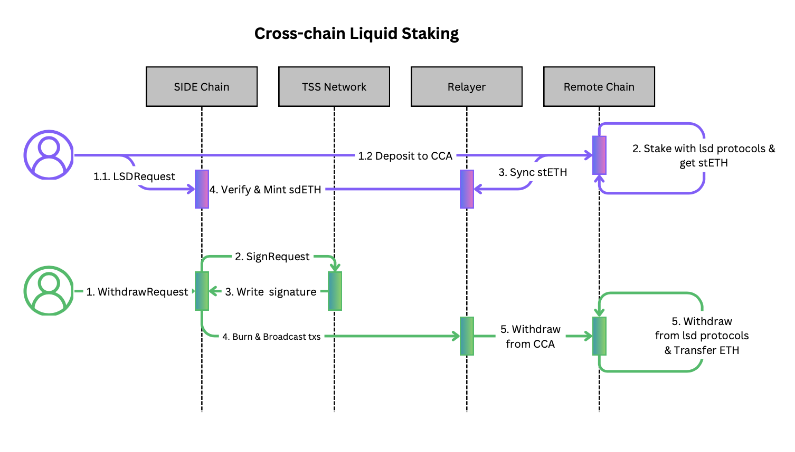

# Liquid Staking

The Liquid Staking is a CCA app enables users to deposit ETH into Lido before its peggyed on the SIDE chain. This allows users to obtain rewards from both Lido and the SIDE chain. This app only works on ethereum for now.

In this app, the vault is a contract controlled by the TSS network.
## Technical Specification

### Transaction Flow



### Data Structure
```ts
interface LSDStaking {

}

interface LSDWithdraw {

}
```

### Messages

```proto
message MsgLSDDeposit {
    string desiredSender = 1;
    string poolId = 2;
    repeated Coin tokens = 3;
    string channelId = 4;
}
```

```proto
message MsgLSDWithdraw {
    string recipient = 1;
    string poolId = 2;
    Coin token = 3;
    string channelId = 4;
}
```

### MessageHandler

```ts
function handleMsgLSDDeposit(msg: MsgLSDDeposit) {

    // request remote deposit
    const request: IntentRequest  = {
        sender: msg.sender,
        channelId: msg.channelId,
        action: "LSDDeposit",
        expectedSender: msg.desired_sender, // the expected sender of inboundTx on
        expectedReceivedToken: msg.token,
        hash: "",
        status: "INITIATED",
        inboundTx: [],
        createAt: block.timestamp,
    }

    store.registerInboundRequest(request)

}
```

```ts
function handleMsgLSDWithdraw(msg: MsgLSDWithdraw) {

    abortTransactionUnless(msg.token.amount > 0)

    let channel = store.getChannel(msg.channelId);
    let adapter = TX_REGISTRY.getAdapter(msg.channelId);
    let pool = store.getPool(msg.poolId)
    abortTransactionUnless(pool.supply.denom === msg.token.denom)

    let escrowedAddress = getEscrowedAccount(`${AppName}/${poolId}`)
    bank.sendTokenToAccount(msg.sender, escrowedAddress, t.token)

    let requestId = store.registerOutboundSigningRequest(
        adapter.buildSigningRequest("LSDWITHDRAW", channel, msg.recipient, msg.token)
    );

    let newWithdraw = {
        sender: msg.sender, // local sender
        token: msg.token,
        requestId,
        status: "Initial",
        createdAt: block.timestamp,
        completedAt: 0,
    }
    store.save(newWithdraw)
}
```

### Transaction Handler

```ts
function onInboundExecuted(request: IntentRequest) {}
```

```ts
function onInboundConfirmed(request: IntentRequest) {}
```

```ts
function onInboundFinalized(request: IntentRequest) {
    const channel = store.getChannel(request.channelId);
    const adapter = new DepositEthereumResposne(request, channel, deposit);
    const ok = adapter.verify();
    if (!ok) return;

    let deposit = store.getDeposit(request.referenceId);
    let newLSDToken = new Coin(request.expectedToken.amount, LSD_DENOM);
    if (request.expectedToken.amount > 0) {
        bank.mint(ModuleName, newLSDToken);
        bank.sendTokenFromModuleToAccount(ModuleName, msg.sender, newLSDToken);
    }
    deposit.status === 'Finalised'
    store.save(deposit);
}
```

```ts
function onInboundExpired(request: IntentRequest) {}
```

```ts
function onOutboundSigned(request: SigningRequest) {
    let withdraw = store.getWithdraw(request.referenceId);
    if (request.spendToken.amount > 0) {
        bank.burn(ModuleName, request.spendToken);
    }
    withdraw.status = 'Executed'
    store.save(withdraw)

}
```

```ts
function onOutboundBroadcasted(request: SigningRequest) {}
```

```ts
function onOutboundExecuted(request: SigningRequest) {}
```

```ts
function onOutboundConfirmed(request: SigningRequest) {}
```

```ts
function onOutboundFinalized(request: SigningRequest) {
    let withdraw = store.getWithdraw(request.referenceId);
    withraw.status = 'Finalised'
    store.save(withdraw)
}
```
